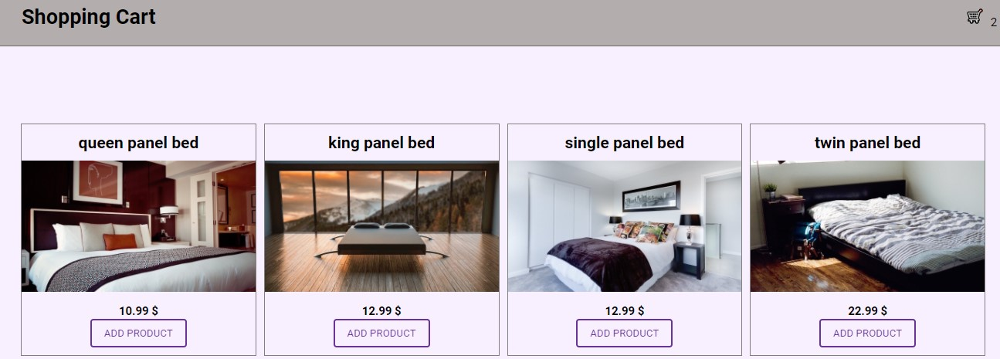

# Shopping Cart app build with JavaScript

# Live demo

> https://pensive-mccarthy-f9998a.netlify.app




## Table of contents

- [General info](#general-info)
- [Code Examples](#code-examples)
- [Features](#features)
- [Contact](#contact)

## General info

- Responsive, build with HTML/CSS/JS.

## Code Examples

./js/products.js

```
// loop thorough data and display each field
function displayData(data) {
  data.items.forEach((item, index) => {
    const div = document.createElement('div');
    div.classList.add('product-item');
    div.id = item.sys.id;

    div.innerHTML = `
          <div class="product__${index + 1}">
          <h3 class="product__${index + 1}--title">${item.fields.title}</h3>
          <div class="product__${index + 1}--image">
          
          </div>
          <h5 class="product__1--price">${item.fields.price} $</h5>
          <button class="btn add-cart">Add product</button>
          </div>
      `;

    productContainer.append(div);
  });

  loadListeners();
  loadPreviousCart();
  loadPreviousQtyCart();
}

function loadListeners() {
  const addCartBtn = document.querySelectorAll('.add-cart');

  addCartBtn.forEach((btn) => btn.addEventListener('click', handleAddProduct));
}

function loadPreviousCart() {
  const prevCart = getLocalStorage('currentCart');
  currentCart = prevCart ? prevCart : [];
  prevCart && displayCartItems(currentCart);
}

function loadPreviousQtyCart() {
  displayCartIcon('initialState');
}
```

## Features

- Everything saves to localStorage
- You can see your cart number updating as you add more items

You can:

- Add a product
- Change quantity
- Delete product

## Technology used

The project is created with:

- JavaScript

## Contact

Coded by Cudi - feel free to contact me!
